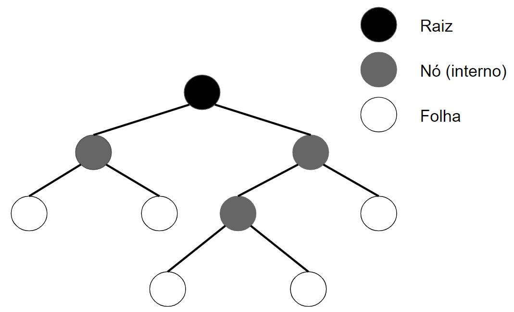
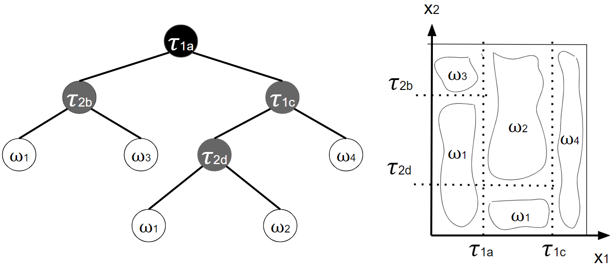

<style>
    legend {
        font-size: 16px;
    }
    main {
        text-align: justify;
    }
</style>

# 3.2 Árvores de decisão

No contexto da teoria de garfos, uma árvore binária é estruturada através de vértices (ou nós) e relação hierárquicas. Partindo de um nó, usualmente denominando raiz, podem ser definidas ramificações bipartidas sucessivas, as quais determinam novos nós. Um nó é dito interno desde que produza ramificações, caso contrário é denominado folha. A Figura 3.4 ilustra a estrutura discutida.

<div align="center"> 

 <legend>Figura 3.4 - Exemplo de árvore de decisão binária.</legend> </div>

A estrutura fornecida por este tipo de garfo favoreceu uma abordagem de classificação não linear distinta das discussões anteriores, denominadas árvores de decisão. Em geral, a modelagem de uma árvore de decisão é baseada em verificações sucessivas sobre os atributos dos padrões em um conjunto de treinamento. Tais verificações consistem em determinar um limiar que atuará apenas sobre um dos atributos  dos padrões e, por sua vez, que permite dividir os exemplos em dois subconjuntos cujas respectivas variabilidades são minimizadas. Esse processo é realizado sucessivamente até que subconjuntos gerados apresentem variabilidade inferior a um valor preestabelecido. A Figura 3.5 traz um exemplo de árvore de decisão e a separação proporcionada sobre os dados no espaço de atributo.

<div align="center"> 

 <legend>Figura 3.5 - Particionamento efetuado sobre o espaço de atributos pela árvore de decisão.</legend> </div>

Entre diferentes propostas existentes na literatura para construção de árvores de decisão aplicadas à classificação de padrões e regressão, as discussões que seguem referem-se ao método denominado CART ($\textit{Classification and Regression Trees}$).

Formalmente, partimos de $D = \{(\textbf{x}_{i},y_{i}) \in  \mathcal{X} × \mathcal{Y}: \ i=1,...m\}$ como conjunto de treinamento, sendo $\mathcal{X}⊆\mathbb{R}^{n}$ e $\mathcal{Y}=\{1,...,c\}$, o qual é relacionado ao conjunto de classes $\Omega=\{\omega_{1},...\omega_{c}\}$. Como já empregado, $y_{i}$ atua como indicador de classe, talque $y_{i}=j$ implica que que $\textbf{x}_{i}$ está associado à classe $\omega_{j}$.

Conforme evidenciado, ao longo do processo de construção da árvore de decisão, são utilizados subconjuntos $D$ cada vez mais restritos. A fim de generalizar as notações, será denominado $Q$ o subconjunto de elementos de $D$ considerado em um nó desta árvore. Em um primeiro momento, na raiz da árvore, o conjunto $Q$ equivale a $D$.

Assim, para um nó qualquer, $Q$ é composto por $q$ pares $(\textbf{x},y)$. Independentemente do comportamento dos padrões $\textbf{x}$ em $Q$ e do atributo considerado, existem, no máximo, $𝜏\leq q$ valores que permitem a divisão deste conjunto em duas partes. No entanto, devido a possíveis repetições de valores que cada um dos atributos pode apresentar, a quantidade de candidatos a limiar para divisão de $Q$ pode variar em função dos atributos.

Seja $Q_{k} = \{x_{k}:(\textbf{x},y)\in Q; \ \textbf{x}=[x_{1},...,x_{k},...,x_{n}]\}$ o conjunto de valore observados, sem separação, sobre o k-ésimo atributo dos exemplos de Q. No contexto desta discussão, podem ser definidos $𝜏_{kh}$ valores, com $k=2,...n$ e $h=1,...,\#Q_{k}$, que, por sua vez, determinam $Q_{inf}(𝜏_{kh})$ e $Q_{sup}(𝜏_{kh})$ como subconjuntos de $Q$, cujo valor do k-ésimo atributo de seus vetores $\textbf{x}$ é inferior ou maior-ou-igual a $𝜏_{kh}$, respectivamente. Ou seja:

<div align="center"> 

$\begin{equation}
Q_{inf}(𝜏_{kh}) = \{(\textbf{x},y) \in Q:x_{k} < 𝜏_{kh}\}
\end{equation}$

$\begin{equation}
Q_{sup}(𝜏_{kh}) = \{(\textbf{x},y) \in Q:x_{k} \geq 𝜏_{kh}\}
\end{equation}$ </div>

A fim de quantificar a variabilidade de classes em $Q$, também denominada impureza, é usual o emprego da medida de Entropia da Informação, expressa na Equação 3.7. Cabe observar que o valor máximo desta medida é atingido quando as probabilidades de ocorrência das classes se tornam iguais. Logo, sua minimização leva à mínima incerteza com que os elementos deste conjunto são associados a uma das classes do problema.

<div align="center"> 

$\begin{equation}
I(Q) = - \sum_{j=1}^{c} P(\omega_{j}|Q)\log_{2}P(\omega_{j}|Q) \tag{3.7}
\end{equation}$

em que:

$\begin{equation}
P(\omega_{j}|Q)=\frac{1}{\#Q} \sum_{i=1}^{\#Q} \delta_{j}(y_{i})
\end{equation}$

$\begin{equation}
\delta_{j}(y_{i}) = \left \{ \begin{matrix} 1; \ se \ y_{i}=j \\ 0; \ caso \ contrário \end{matrix} \right.
\end{equation}$ </div>

Dessa forma, diante da escolha de um limiar $𝜏_{kh}$, é possível medir a redução da impureza que será proporcionada ao subdividir $Q$ em $Q_{inf}(𝜏_{kh})$ e $Q_{sup}(𝜏_{kh})$, conforme definido na Equação 3.7. é importante destacar que a determinação de $𝜏_{kh}$ é alcançada de forma exaustiva com base nos valores de $Q_{k}$, para $k=1,...,n$.

<div align="center"> 

$\begin{equation}
\Delta I(Q;𝜏_{kh})= I(Q)-\frac{\#Q_{inf}(𝜏_{kh})}{\#Q}I(Q_{inf}(𝜏_{kh}))-\frac{\#Q_{sup}(𝜏_{kh})}{\#Q}I(Q_{sup}(𝜏_{kh})) \tag{3.8}
\end{equation}$ </div>

Nestas condições, quando $\Delta I(Q;𝜏_{kh})$ supera um limiar $\zeta \in \mathbb{R}_{+}$ preestabelecido e a quantidade de elementos $Q$ também supera um número mínimo $\psi \in \mathbb{N}^{*}$, torna-se justificada a necessidade de divisão entre $Q_{inf}(𝜏_{kh})$ por $D_{sup}(𝜏_{kh})$. Nesse caso, todos os processos discutidos anteriormente são conduzidos em caráter recursivo sobre cada subconjunto obtido, os quais caracterizam novos nós da árvore de decisão em construção e possuem $Q$ igual a $Q_{inf}(𝜏_{kh})$ e $D_{sup}(𝜏_{kh})$, respectivamente.

Caso a divisão não se justifique, o nó associado ao conjunto (local) $Q$ é caracterizado como uma "folha" e, por sua vez, deve representar uma das classes $\omega^{*} \in \Omega$. Para tal associação, a seguinte regra pode ser empregada:

<div align="center"> 

$\begin{equation}
\omega^{*} = arg\max_{\omega_{j}\in\Omega}P(\omega_{j}|Q) \tag{3.9}
\end{equation}$ </div>

Uma vez cessado o crescimento da árvore de decisão, o processo de treinamento é finalizado. Por conseguinte, o processo de classificação de um padrão não rotulado é efetuado a partir de sua apresentação na raiz da árvore de decisão, sendo, então, submetido sequencialmente às diversas regras relacionadas aos nós até que uma folha seja alcançada. A classe representada pela folha em questão determina a classificação do padrão em estudo.

Como exemplo de aplicação, a Figura 3.6 ilustra o comportamento das superfícies  de decisão delineadas pelo método CART sobre a conhecida base de dados Iris, que apresenta um problema multiclasse que possui características lineares e não lineares. O particionamento do espaço de atributos através de limiares constantes em relação aos atributos, similar à concepção da Figura 3.6, proporciona o aspecto de "setores".

<div align="center"> 

 <legend>Figura 3.6 - Exemplo de aplicação do método CART utilizando a base de dados Iris.</legend> </div>

A partir da biblioteca Scikit-Learn, com a importação do módulo $\textbf{tree}$, a implementação do classificador CART torna-se acessível via $\textbf{DecisionTreeClassifier}$. O código 3.2 apresenta apenas o trecho de importação do módulo citado e a instanciação de um classificador CART. O uso das funções de treinamento e predições/classificação é idêntico ao caso do classificador SVM. Os parâmetros $\textbf{criterion}$,$\textbf{min_samples_split}$ e $\textbf{min_impurity_decrease}$ referem-se ao tipo da medida de impureza e aos parâmetros $\psi$ e $\zeta$, respectivamente. A configuração $\textbf{criterion='entropy'}$ determina que a construção da árvore de decisão é baseada na medida de entropia.

```
#Código 3.2 - Instanciação do Classificador Árvore de Decisão

#importação
from sklearn import tree

#Instanciação do classificador 'g'
g = DecisionTreeClassifier(criterion='entropy',min_samples_split=2,min_impurity_decrease=10**(-7))
```

```
#Exemplo 2 - Aplicação do classificador de árvore de decisão ao dataset Iris e plotagem das superfícies de decisão

from sklearn.datasets import load_iris

iris = load_iris()

import matplotlib.pyplot as plt
import numpy as np

from sklearn.datasets import load_iris
from sklearn.inspection import DecisionBoundaryDisplay
from sklearn.tree import DecisionTreeClassifier

# Parâmetros
n_classes = 3
plot_colors = "ryb"
plot_step = 0.02


for pairidx, pair in enumerate([[0, 1], [0, 2], [0, 3], [1, 2], [1, 3], [2, 3]]):
    # Selecionando os atributos aos pares
    X = iris.data[:, pair]
    y = iris.target

    # Treino
    clf = DecisionTreeClassifier(criterion='entropy',min_samples_split=2,min_impurity_decrease=10**(-7)).fit(X, y)

    # Plotagem da superfície de decisão
    ax = plt.subplot(2, 3, pairidx + 1)
    plt.tight_layout(h_pad=0.5, w_pad=0.5, pad=2.5)
    DecisionBoundaryDisplay.from_estimator(
        clf,
        X,
        cmap=plt.cm.RdYlBu,
        response_method="predict",
        ax=ax,
        xlabel=iris.feature_names[pair[0]],
        ylabel=iris.feature_names[pair[1]],
    )

    # Plotagem dos pontos de treinamento
    for i, color in zip(range(n_classes), plot_colors):
        idx = np.where(y == i)
        plt.scatter(
            X[idx, 0],
            X[idx, 1],
            c=color,
            label=iris.target_names[i],
            cmap=plt.cm.RdYlBu,
            edgecolor="black",
            s=15,
        )

plt.suptitle("Superfície de decisão de árvores de decisão treinadas em pares de atributos")
plt.legend(loc="lower right", borderpad=0, handletextpad=0)
_ = plt.axis("tight")
```