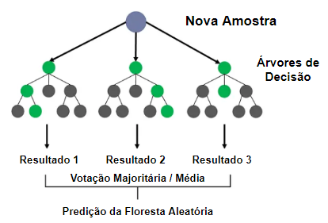

# 4.3 Floresta Aleatória

A estratégia de random forest é um algoritmo de aprendizado supervisionado que usa um conjunto de árvores de decisão para classificar ou prever um resultado. O conjunto de árvores de decisão é gerado aleatoriamente, o que ajuda a reduzir o viés e melhorar a precisão.Dessa forma, pode-se dizer que a estratégia é um caso particular de stacking.

O processo inicia ao fornecer um conjunto de dados de treinamento ao algoritmo. Então, um conjunto de árvores de decisão é gerado aleatoriamente, com cada árvore sendo treinada em um subconjunto aleatório do conjunto de dados de treinamento. Em seguida, cada árvore de decisão é usada para fazer uma previsão do resultado. Finalmente, a previsão final é determinada pela combinação dos resultados das árvores de decisão. a Figura 4.4 ilustra o processo.

 

 <legend>Figura 4.4 - Representação da estratégia random forest.</legend>

A aleatoriedade na geração das árvores de decisão ajuda a reduzir o viés. Isso ocorre porque cada árvore de decisão é treinada em um subconjunto aleatório do conjunto de dados de treinamento. Isso significa que cada árvore de decisão é menos propensa a ser tendenciosa em relação a qualquer característica particular do conjunto de dados de treinamento.
