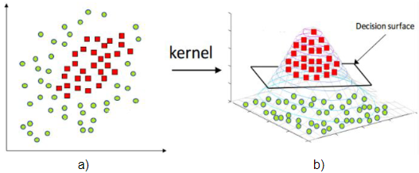
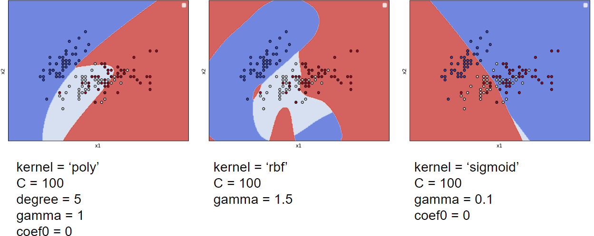

<style>
    legend {
        font-size: 16px;
    }
    main {
        text-align: justify;
    }
</style>

# 3.1 Máquinas de vetores de suporte e função kernel

A formulação exposta na Seção 2.4 apresenta como são obtidos os hiperplanos de separação através do método SVM. No entanto, conforme já discutido e justificado, existem problemas nos quais o uso de hiperplanos não proporciona uma separação adequada/razoável. Como alternativa, é possível remapear os padrões que não são linearmente separáveis no espaço de atributos original para outro espaço, denominado espaço característico, onde a separabilidade pode ser maior. Na Figura 3.2 b), é ilustrado um exemplo fictício de mapeamento dos padrões apresentados na Figura 3.2 a), possibilitando, assim, a separação linear.

<div align="center"> 

 <legend>Figura 3.2 - Exemplo de mapeamento dos padrões para um espaço de maior dimensão que proporciona separação linear.</legend> </div>


O processo de mapeamento exemplificado na Figura 3.2 pode ser conduzido implicitamente nas formulações apresentadas nas seções 2.4.1 e 2.4.2. Para tal, basta substituir os produtos internos $\textbf{w}^{T}\textbf{x}^{i}$ e $\textbf{w}^{T}\textbf{x}_{i}^{T}\textbf{x}_{j}$ presentes na regra de decisão (2.17) e na função objetivo (2.21) do método por uma função $K(\cdot,\cdot)$ que respeite as condições do $\textit{Teorema de Mercer}$:

$\textbf{Teorema de Mercer}$: seja $\textbf{u}$,$\textbf{v}$ $\in \mathcal{X} \subseteq \mathbb{R}^{n}$ e $\phi(\cdot)$ um mapeamento $\textbf{u}→\phi(\textbf{u})\in \mathcal{H}$ sendo $\mathcal{H}$ um espaço de Hilbert. O produto interno $\phi(\textbf{u})^{T}\phi(\textbf{v})$ é equivalente à função contínua e simétrica $K(\textbf{u},\textbf{v})$ que satisfaz:

<div align="center">

$\begin{equation}
\int_{\mathcal{X}}\int_{\mathcal{X}}K(\textbf{u},\textbf{v})h(\textbf{u})d\textbf{u}d\textbf{v} \ \geq 0 \tag{3.1}
\end{equation}$

para qualquer $h(\textbf{u})$, tal que:

$\begin{equation}
\int_{\mathcal{X}}h(\textbf{u})^{2}d\textbf{u}<+∞ \tag{3.2}
\end{equation}$ </div>

Como consequência deste teorema, para qualquer função $K(\cdot,\cdot)$ que satisfaça as condições 3.1 e 3.2, é possível afirmar que existe um espaço vetorial onde tal função define um produto interno. Essas funções são denominads $\textbf{funções kernel}$.

Embora o Teorema de Mercer forneça condições necessárias para construção de funções que definem o produto interno em algum espaço vetorial, não são fornecidos meios para definir qual é este espaço, ou seja, não é fornecida uma maneira direta de definir  $\phi(\cdot,\cdot)$ a partir de $K(\cdot,\cdot)$. Além disso, verificar que uma dada função $K(\cdot,\cdot)$ atende às condições do Teorema de Mercer pode não ser trivial.

Alguns exemplos de funções kernel frequentemente adotadas na resolução de problemas gerais são as funções de Base Radial ($\textit{Radial Basis Function}$ - RBF), Polinomial e Sigmoide, apresentadas respectivamente nas Equações 3.3, 3.4 e 3.5. O produto interno ente os vetores do espaço de atributos é denominado por função kernel Linear, apresentado na Equação 3.6.

<div align="center">

$\begin{equation}
K_{RBF}(\textbf{x}_{i},\textbf{x}_{j}) = \mathcal{e}^{-γ||\textbf{x}_{i}-\textbf{x}_{j}||^{2}} \tag{3.3}
\end{equation}$
\
$\begin{equation}
K_{Pol}(\textbf{x}_{i},\textbf{x}_{j}) = (\gamma \textbf{x}_{i}^{T}\textbf{x}_{j} + α)^{q} \tag{3.4}
\end{equation}$
\
$\begin{equation}
K_{Sigm}(\textbf{x}_{i},\textbf{x}_{j}) = (\gamma \textbf{x}_{i}^{T}\textbf{x}_{j} + α) \tag{3.4}
\end{equation}$
\
$\begin{equation}
K_{Linear}(\textbf{x}_{i},\textbf{x}_{j}) = \textbf{x}_{i}^{T}\textbf{x}_{j} \tag{3.5}
\end{equation}$ </div>

em que $q \in \mathbb{R}^{*}_{+}$ e $\gamma$,$\alpha \in \mathbb{R}^{*}_{+}$ são parâmetros associados.

As funções kernel possuem ainda propriedades úteis na definição de novos kernels. Algumas destas propriedades são:

  $\cdot$ Combinação entre kernels: sejam $K_{1}$ e $K_{2}$ duas funções kernel, então qualquer combinação linear $v_{1}K_{1} + v_{2}K_{2}$, em que $v_{1},v_{2}\geq 0$, é uma função kernel;
  
  $\cdot$ Produto de Schur: sejam $K_{1}$ e $K_{2}$ duas funções kernel, então $K_{1}\cdot K_{2}$ é uma função kernel;
  
  $\cdot$ Multiplicação por escalar: seja $K_{1}$ uma função kernel e $v \ in mathbb{R}^{+}$, então $vK_{1}$ é uma função kernel;
  
  $\cdot$ Multiplicação entre funções: sejam $h_{1}$ e $h_{2}$ duas funções reais, definidas no espaço de atributos $\mathcal{X} ⊂ \mathbb{R}^{n}$, então $h_{1}\cdot h_{2}$ é uma função kernel.

Existem ainda formas alternativas de construir as funções kernel a partir de resultados já apresentados na literatura, como utilizando o modelo de funções kernel de base radial, definidos por:

<div align="center">

$\begin{equation}
K(\textbf{x}_{i},\textbf{x}_{j}) = f(m(\textbf{x}_{i},\textbf{x}_{j})) \tag{3.6}
\end{equation}$ </div>

em que $m: \ \mathcal{X} \times \mathcal{X} → \mathbb{R}_{+}$ é uma métrica e $f: \mathbb{R} → \mathbb{R}$ é uma função contínua estritamente positiva, como a função exponencial $f(x) = \mathcal{e}^{-x}$.

Para fins de exemplificação, o método SVM é aplicado sobre um problema multicalsse usando as funções kernel RBF, Polinomial e Sigmoide. Os resultados são apresentados na Figura 3.3.

<div align="center"> 

 <legend>Figura 3.3 - Superfícies de decisão obtidos pelo classificador SVM utilizando diferentes funções kernel e parametrizações.</legend> </div>

Quando feito o uso do kernel Polinomial com parâmetros $q=1$, $\gamma = 1$ e $\alpha = 0$, ele é reduzido ao kernel linear, o que também reduz o método SVM à sua versão linear (Seção 2.4.2). Uma maior flexibilização da superfície de decisão é alcançada com o aumento do parâmetro $q$, relacionado ao grau do polinômio implícito que mapeia os dados para um novo espaço de dimensão superior. Em relação ao kernel RBF, o aumento de $\gamma$ também proporciona superfícies de decisão ajustadas de características e particularidades dos dados. por outro lado, quando utilizado o kernel Sigmoide, o aumento de $\gamma$ implica em superfícies de decisão com maior tendência linear.

Em relação ao emprego da biblioteca Scikit-Learn para aplicação do método SVM com uso das funções kernel discutidas, é suficiente que sejam declarados os parâmetros que estabelecem o kernel desejado e suas respectivas parametrizações. A opção $\textbf{kernel='poly'}$, $\textbf{'rbf'}$ ou $\textbf{'sigmoid'}$ determina a função kernel a ser empregada entre as formas Polinomial, RBF e Sigmoide, respectivamente. Em relação aos parâmetros $q$, $\gamma$ e $\alpha$, eles são determinados através de $\textbf{degree}$, $\textbf{\gamma}$ e $\textbf{coef0}$. No código 3.1, estão exemplificadas as instanciações de classificadores SVM com o uso da funções kernel discutidas e os parâmetros associados.

```
#Código 3.1 - Diferentes instanciações do classificador SVM com uso de funções kernel

g1 = SVC(C=100, kernel='poly',degree=5, coef0=0,gamma=1, decision_function_shape='ovr')

g1 = SVC(C=100, kernel='rbf', coef0=0, gamma=1.5, decision_function_shape='ovr')

g1 = SVC(C=100, kernel='sigmoid', degree=5,coef0=0, gamma=1.5, decision_function_shape='ovr')
```