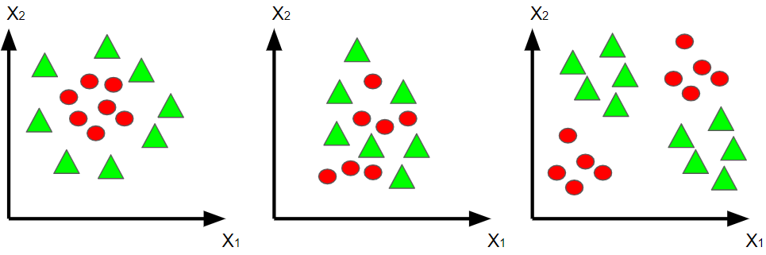

# Capítulo 3: Classificadores não lineares

No capítulo anterior foram apresentados métodos capazes de realizar a distinção entre pares de classes linearmente separáveis. A aplicação desses métodos em problemas que envolvem classes não linearmente separáveis não foi restringida, mesmo sabendo de antemão que ocorrerão erros no processo de classificação. No entanto, existem casos em que a tentativa de distinguir duas classes através de uma superfície de decisão linear é inviável. A Figura 3.1 exemplifica problemas desta natureza. Uma forma de contornar este tipo de problema é fazendo uso de classificadores não lineares.

 

 <legend>Figura 3.1 - Casos que inviabilizam a separação entre classes de forma linear.</legend> 

