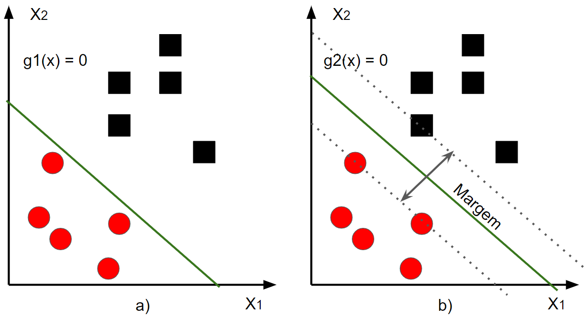
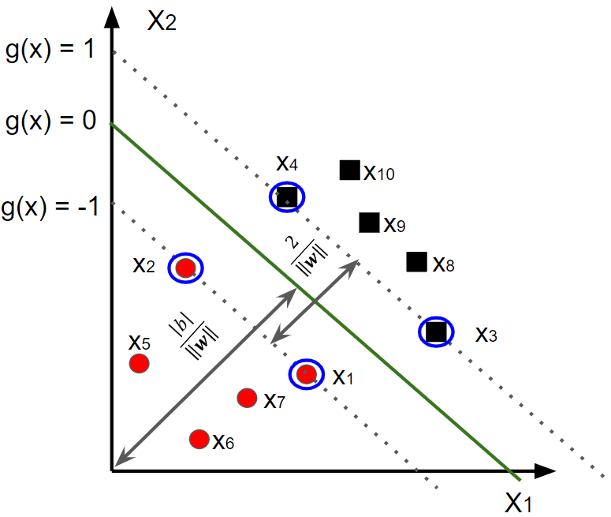
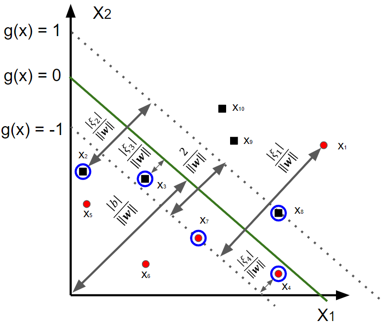
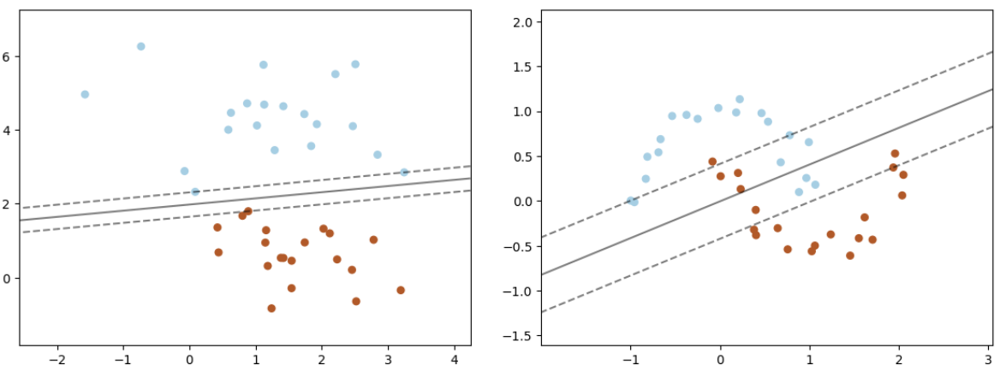

<style>
    legend {
        font-size: 16px;
    }
    main {
        text-align: justify;
    }
</style>

# 2.4 Máquina de vetores de suporte (SVM) - versão linear

O algoritmo de Máquina de Vetores de Suporte (SVM - $\textit{Support Vector Machine}$), é um algoritmo de aprendizado supervisionado que pode ser usado para classificação ou regressão. Ele é um dos algoritmos mais populares de aprendizado de máquina e é usado em uma ampla variedade de aplicações, incluindo reconhecimento de imagens, classificação de texto e processamento de sinais.

O SVM funciona encontrando um hiperplano no espaço de características que separa os dados de duas classes diferentes. O hiperplano é escolhido de forma a maximizar a margem entre os dados das duas classes. A margem é a distância entre o hiperplano e os pontos de dados mais próximos de cada classe.

Para encontrar o hiperplano com a margem máxima, o algoritmo SVM usa um processo de otimização que minimiza uma função de custo. A função de custo é escolhida de forma a garantir que o hiperplano esteja suficientemente separado dos dados de cada classe.

O SVM pode ser usado para classificar dados linearmente separáveis ou não linearmente separáveis. No caso de dados linearmente separáveis, o hiperplano pode ser encontrado diretamente usando um método de programação linear. No caso de dados não linearmente separáveis, o algoritmo SVM usa uma função kernel para transformar os dados para um espaço de características de maior dimensão, onde eles podem ser separados linearmente. A seguir, serão apresentadas as duas estratégias.

## 2.4.1 Formalização baseada em padrões linearmente separáveis

O método SVM consiste em definir uma função discriminante linear $g$ capaz de classificar um conjunto de padrões linearmente separável $D=\{(\textbf{x}_{i},y_{i}):i=1,...,m\}$ entre as classes $ω_{1}$, quando $y_{i}=+1$, e $w_{2}$, se $y_{i}=-1$. Além disso, a funções discriminante em questão busca pela maior margem de separação entre os exemplos deste par de classes.

A função discriminante em questão, segundo o método SVM, corresponde ao hiperplano que distingue os exemplos de $D$. Sua expressão é equivalente à forma discutida na Equação 2.1 e exemplificada pelas discussões da Figura 2.1. Um simples detalhe de notação refere-se à troca de notação do termo $ω_{0}$ por $b$, cujo significado não sofre alteração.

A Figura 2.7 apresenta dois exemplos de hiperplanos, $g_{1}$ e $g_{2}$. Embora ambos os hiperplanos sejam capazes de separar adequadamente os conjuntos de padrões $⋆$ e $\circ$, o hiperplano $g_{1}$ apresenta maior margem de separação. Assim, tal hiperplano possui maiores condições de manter a separabilidade entre as classes caso novos padrões sejam considerados, isto é, sua capacidade de generalização é maior em comparação a $g_{2}$.

<div align="center">

 <legend>Figura 2.7 - Padrões linearmente separáveis e hiperplanos capazes de efetuar a separação entre as classes. O hiperplano g2 em b) proporciona maior margem de separação.</legend> </div>

A determinação do hiperplano associado a maior margem de separação é baseada na simples relação de distância entre ponto e reta. A distância entre um padrão (ponto) $\textbf{x}_{i}$ qualquer e o hiperplano de separação (reta) $g(\textbf{x})=0$ é calculada por $\frac{|g(\textbf{x}_{i})|}{||\textbf{w}||}$. Reescalonando $\textbf{w}$ de forma que dois padrões $\textbf{x}_{u} \in ω_{1}$ e $\textbf{x}_{v} \in ω_{2}$, ambos contidos em $D$ e caracterizados como os mais próximos de $g(\textbf{x})=0$, estejam distantes à uma unidade deste hiperplano, são obtidas as seguintes relações:

<div align="center">

(i) a margem de separação tem largura $\frac{1}{||\textbf{w}||}+\frac{1}{||\textbf{w}||}=\frac{2}{||\textbf{w}||}$

(ii) dado $\textbf{x}_{u} \in ω_{1}$, então $g(\textbf{w}_{u})= \textbf{w}^{T}\textbf{x}_{u}+b \geq +1$

(iiI) dado $\textbf{x}_{v} \in ω_{2}$, então $g(\textbf{w}_{v})= \textbf{w}^{T}\textbf{x}_{v}+b \leq -1$ </div>

Baseado nessas relações, é modelado o seguinte problema de otimização, cuja solução leva aos parãmetros $\textbf{w}$ e $b$, que proporcionam o hiperplano com máxima margem de separação:

<div align="center">

$\begin{equation}
\min_{\textbf{w},b} \frac{1}{2}\textbf{w}^{T}\textbf{w} \tag{2.11}
\end{equation}$ 

$\begin{equation}
sujeito \ a: y_{i}(\textbf{w}^{T}\textbf{x}_{i}+b)\geq 1, i=1,...,m
\end{equation}$  </div>

A relação (i) é utilizada na definição da função objetivo de (2.11), uma vez que a minimização de $||w||$ (reescrita na forma equivalente $\textbf{w}^{T}\textbf{w}$) torna máxima a margem de largura $\frac{2}{||\textbf{w}||}$. As relações (ii) e (iii), associados aos respectivos inidicadores de classe $y_{i}$, constituem a restrição do problema de otimização. Tal restrição obriga o sinal da função discriminante aplicada em $\textbf{x}_{i}$, isto é, $g(\textbf{x}_{i})= \textbf{w}^{T}\textbf{x}_{i}+b$, a ser concordante com o sinal do indicador $y_{i}$, resultando, assim em uma multiplicação igual ou superior a um.

A Figura 2.8 ilustra as relações geométricas que o hiperplano de margem máxima deve respeitar. Cabe ressaltar que os padrões localizados nos limites das margem de separação (i.e., $g(\textbf{x}=\pm 1)$) são responsáveis por determinar o hiperplano ótimo. Esses padrões são denominados $\textbf{vetores de suporte}$.

<div align="center">

 <legend>Figura 2.8 - Representação do hiperplano de separação, vetores de suporte (circulados) e margem de separação.</legend> </div>

O problema de otimização que determina o hiperplano de margem máxima possui função objetivo convexa com restrições lineares, logo torna-se conveniente resolvê-lo com uso do Método dos $\textbf{Multiplicadores de Lagrange}$. Para isso, inicialmente deve ser construída a função lagrangeana, que consiste na soma da função objetivo do problema (3.11) com combinação linear formada pelas restrições deste problema multiplicadas por escalares não negativos $λ_{i}$, denominados multiplicadores de Lagrange. A seguinte expressão corresponde à forma primal da função lagrangeana do problema (3.11):

<div align="center">

$\begin{equation}
L_{p}(\textbf{w},b,λ) = \frac{1}{2}\textbf{w}^{T}\textbf{w} - \sum_{i=1}^{m} λ[y_{i}(\textbf{w}^{T}\textbf{x}_{i}+b)-1] \tag{2.12}
\end{equation}$ </div>

A solução do problema (2.11) é equivalente ao "ponto de sela" da função lagrangeana (2.12), a qual deve ser minimizada com relação a $\textbf{w}$ e $b$ e máximizada com relação a $λ_{i}$. Diante de sua característica convexa, o valor mínimo da função (3.12) com relação a $\textbf{w}$ e $b$ equivale ao ponto em que sua derivada, com relação a estes parâmetros, é nula. Por conseguinte, surgem as relações:

<div align="center">

$\begin{equation}
\frac{∂L_{p}(\textbf{w},b,λ)}{∂\textbf{w}}=0 ⇒ \textbf{w} = \sum_{i=1}^{m} λ_{i}y_{i}\textbf{x}_{i} \tag{2.13}
\end{equation}$

$\begin{equation}
\frac{∂L_{p}(\textbf{w},b,λ)}{∂b}=0 ⇒ \textbf{w} = \sum_{i=1}^{m} λ_{i}y_{i}=0\tag{2.14}
\end{equation}$ </div>

Substituindo as relações (3.13) e (3.14) na função lagrangeana (3.12), obtém-se como resultado a forma dual da função lagrangeana:

<div align="center">

$\begin{equation}
L_{D}(λ) = \sum_{i=1}^{m}λ-\frac{1}{2}\sum_{i=1}^{m}\sum_{j=1}^{m}λ_{i}λ_{j}y_{i}y_{j}\textbf{x}_{i}^{T}\textbf{x}_{j} \tag{2.15}
\end{equation}$ </div>

Com a eliminaçaõ de $\textbf{w}$ e $b$ nesta nova representação, a solução do problema (3.11) torna-se equivalente a resolução do seguinte problema de otimização:

<div align="center">

$\begin{equation}
\max_{\lambda}L_{D}(\lambda)
\end{equation}$

$\begin{equation}
sujeito \ a \left \{ \begin{matrix} \lambda_{i}\geq 0,i=1,...,m \\ \sum_{i=1}^{m} λ_{i}y_{i} = 0\end{matrix} \right.\tag{2.16}
\end{equation}$ </div>

Os multiplicadores de Lagrange obtidos com a resolução do problema (2.16) permitem o cálculo dos parâmetros que definem o hiperplano de margem máxima. O vetor $\textbf{w}$ é definido através da relação (2.13), já o escalar $b$ pode ser calculado com a substituição de $\textbf{w}$ em $g(\textbf{x}_{i})$, sendo $\textbf{x}_{i}$ um vetor suporte com $y_{i}=+1$, logo $\textbf{w}^{T}\textbf{x}_{i}+b=1$.

Além de proporcionar maior simplicidade no cálculo dos parâmetros ótimos, a representação dual da função lagrangeana possui como fator o produto interno entre os padrões (i.e., $\textbf{x}_{i}^{T}\textbf{x}_{j}$), o que possibilita o uso de funções $\textbf{kernel}$, as quais serão discutidas nas seções seguintes.

Em consequência ao hiperplano de margem máxima obtido, é definida a função discriminante $g(\textbf{x})=\textbf{w}^{T}\textbf{x}+b$, que classifica um dado padrão $\textbf{x}$ de acordo com a seguinte regra:

<div align="center">

$\begin{equation}
g(\textbf{x})=\textbf{w}^{T}\textbf{x}+b \left \{ \begin{matrix} \geq 0 ⇒ \textbf{x} \in ω_{1} \\ < 0 ⇒ \textbf{x} \in ω_{2} \end{matrix} \right. \tag{2.17}
\end{equation}$ </div>

## 2.4.2 Formalização baseada em padrões não linearmente separáveis

O desenvolvimento apresentado na seção anterior é fundamentamentado na suposição de padrões linearmente separáveis. No entante, é natural a existência de problemas envolvendo padrões que não são linearmente separáveis. A fim de contornar este tipo de problema, são inseridas variáveis de folga $\xi \geq 0$ que tornam sempre verdadeiras as seguintes relações:

<div align="center">

(i) dado $\textbf{x}_{i} \in 𝜔_{1}$, então $g(\textbf{x}_{i})=\textbf{w}^{T}\textbf{x}+b\geq+1-\xi_{i}$

(ii) dado $\textbf{x}_{i} \in 𝜔_{2}$, então $g(\textbf{x}_{i})=\textbf{w}^{T}\textbf{x}+b\geq+1-\xi_{i}$ </div>

Geometricamente, as variáveis de folga respresentam o deslocamento em que os padrões classificados erroneamente encontram-se do limite da margem de separação referente a sua respectiva classe, conforme ilustra a Figura 2.9.


<div align="center">

 <legend>Figura 2.9 -Representação do hiperplano de separação para padrões não linearmente separáveis.</legend> </div>

Com intuito de incorporar um custo adicional devido à não separabilidade dos padrões, é introduzido o termo $C\sum_{i=1}^{m} \xi_{i} $ na função objetivo do problema (2.10). Esse termo é responsável por contabilizar e penalizar a ocorrência de classificações incorretas segundo o hiperplano de separação definido. Neste contexto, $C>0$ atua como  um parâmetro regulador. Assim, é proporcionada a seguinte reformulação sobre o problema (2.10):

<div align="center">

$\begin{equation}
\min_{\textbf{w},b} \frac{1}{2}\textbf{w}^{T}\textbf{w} + C\sum_{i=1}^{m} \xi_{i}
\end{equation}$

$\begin{equation}
sujeito \ a: \left\{\begin{matrix} y_{i}(\textbf{w}^{T}\textbf{x}_{i}+b)\geq 1-\xi_{i}, i=1,...,m \\ \xi_{i} > ; \ i=1,...m \end{matrix}\right. \tag{2.18}
\end{equation}$

Por sua vez, a função Lagrangeana na forma primal obtida a partir do problema (2.18) é exepressa por:

$\begin{equation}
L_{p}(\textbf{w},b,λ) = \frac{1}{2}\textbf{w}^{T}\textbf{w}+C\sum_{i=1}^{m} \xi_{i} - \sum_{i=1}^{m} λ_{i}[y_{i}(\textbf{w}^{T}\textbf{x}_{i}+b)-1+\xi_{i}] - \sum_{i=1}^{m} 𝜌_{i}\xi_{i} \tag{2.19}
\end{equation}.$ </div>

em que $𝜌$ é multiplicador de Lagrange inserido para garantir a positividade das variáveis de folga $\xi$.

Seguindo os mesmos procedimentos apresentados na subseção anterior para obtenção da forma dual da função lagrangeana, as derivadas da função (2.19) com relação a $\textbf{w}$, $b$ e $\xi$ devem ser nulas. O resultado dessas derivações em relação a $\textbf{w}$ e $b$ produz os mesmos resultados obtidos em (2.13) e (2.14). Já a derivação com relação a $\xi$ fornece que:

<div align="center">

$\begin{equation}
\frac{\partial L_{P}(\textbf{w},b,λ),𝜌}{\partial \xi_{i}}=0 \tag{2.20}
\end{equation}$ </div>

logo, sendo $λ$ e 𝜌 escalares reais estritamente positivos, concluímos que $0\leq λ_{i} \leq C$.

Após as devidas substituições, a forma dual da função lagrangeana para o caso não separável torna-se idêntica à (2.15). Com isso, o problema de otimização formulado para o tratamento de padrões não linearmente separáveis difere do problema (2.16) apenas com relação às restrições, ou seja:

<div align="center">

$\begin{equation}
\max_{λ}\sum_{i=1}^{m} λ_{i} - \frac{1}{2}\sum_{i=1}^{m}\sum_{j=1}^{m} λ_{i}λ_{j}y_{i}y_{j}\textbf{x}_{i}^{T}\textbf{x}_{j}
\end{equation}$

$\begin{equation}
sujeito \ a:\left\{\begin{matrix} 0 \leq \lambda_{i} \leq C, i=1,...,m \\ \sum_{i=1}^{m} \lambda_{i}y_{i}=0 \end{matrix}\right. \tag{2.21}
\end{equation}$ </div>

Com a otimização do problema (3.21), a obtenção do parâmetro $\textbf{w}$ decorre da mesma forma realizada para o caso linearmente separável. Já o cálculo de $b$ é alcançado a partir da primeira restrição do problema (3.18), adotando qualquer vetor suporte cuja variável de folga seja nula.

Com o intuito de visualizar o comportamento dos hiperplanos de separação determinados através do método SVM, a Figura 2.11 ilustra a aplicação deste método sobre dados linearmente separáveis e não linearmente separáveis. A respeito do caso envolvendo dados linearmente separáveis, é possível observar que a superfície de decisão, quando comparada aos métodos discutidos nas seções anteriores, encontra-se mais afastada dos exemplos de treinamento que ocupam a região de transição. Sua aplicação sobre dados não linearmente separáveis proporciona uma superfície de decisão similar às obtidas pelos métodos abordados anteriormente.

<div align="center">

 <legend>Figura 2.10 - Hiperplanos de separação obtidos pelo SVM diante de dados linearmente separáveis (esquerda) e não linearmente separáveis (direita).</legend> </div>

Por outro lado, diferentemente dos métodos discutidos nas seções anteriores, em especial devido tanto à dificuldade quanto à estruturação e resolução do problema dado pela Equação 2.21, não será realizada a implementação do método SVM. Neste caso, a implementação disponibilizada pela biblioteca Scikit-Learn é uma alternativa. Além de conter funções relacionadas ao método SVM, esta biblioteca inclui ainda funcionalidades que serão abordadas nos tópicos que seguem.

O Código 2.4 exibe um conjunto de comandos que contemplam a instanciação do objeto que representa o classificador, seguido pleo seu treinamento e aplicação na predição do indicador de classe de um dado padrão. Na linha 16, durante a instanciação do objeto $g$, são observados os parâmetros $C$ e $\mathbb{kernel}$, os quais se referem à penalidade (C) e ao tipo de função kernel adotada, neste caso, linear, implicando, assim, que o produto interno $\textbf{x}_{i}^{T}\textbf{x}_{j}$, presente na Equação 2.21 não seja substituído por uma outra forma alternativa.

```
#Importação da "Scikit-Learn" das funções relacionadas ao SVM
from sklearn import svm

#Obtenção de exemplos de treinamento (Dataset IRIS) (3 classes)
from sklearn import svm, datasets
from sklearn.model_selection import train_test_split #Função que divide o conjunto de dados em treinamento e validação
iris = datasets.load_iris()

X = iris.data[:, :2]  # Selecionando apenas as duas primeiras características
y = iris.target

#Divisão dos conjunto de treino e validação
X_train,X_test,Y_train,Y_test = train_test_split(X,y,test_size = 0.33,random_state=42)

#Instanciação do classificador "g"
g = svm.SVC(C=100, kernel='linear')

#Treinamento do modelo
g.fit(X_train,Y_train)

#Predição do indicador de classe
pred = g.predict(X_test)

#Acurácia
import numpy as np
acc = round(np.mean(pred == Y_test)*100,2)
print(acc)
```

A partir desse primeiro emprego da Scikit-Learn, vale destacar dois elementos que serão obsercados com muita frequência nos próximos usos desta biblioteca: a instanciação do método e a utilização das funções $\mathbb{fit}$ e $\mathbb{predict}$. Na instanciaçã, é criado um objeto relativo ao método em questão. Por outro lado, ao passo que $\mathbb{fit}$ efetua o treinamento do método, $\mathbb{predict}$ atua na rotulação de padrões, ou seja, duas etapas elementares em um processo de classificação. A maioria dos métodos implementados na biblioteca Scikit-Learn estão munidos das funções $\mathbb{fit}$ e $\mathbb{predict}$. Para uma verificação mais ampla a respeito da estrutura e das funções presentes nesta biblioteca, é sugerida a leitura do "guia do usuário".

## 2.4.3 Otimização quadrática, parâmetros e o custo computacional

O método SVM apresenta certas vantagens em relação a outros métodos, a citar, aqueles baseados na ideia do gradiente descenedente ou no ajuste de distribuições de probabilidade. Nestes exemplos, o aprendizado é sensível aos parâmetros de inicialização e pode conduzir a resultados subótimos (mínimos locais). Ao contrário, o processo de aprendizado do método SVM é realizado pela otimização de problemas quadráticos convexos, o que implica em soluções únicas e definidas explicas explicitamente.

Uma fragilidade decorrente do problema de otimização associado ao SVM refere-se ao número de parcelas da função objetivo, que cresce quadraticamente em relação ao número de padrões de treinamento. Esta característica torna crítico seu aprendizado diante de grandes conjuntos de dados. Tal fato tem motivado, ao longo do anos, o desenvolvimento e aprimoramento de algoritmos capazes de otimizar o processo de aprendizado. Exemplos de algoritmos destinados a esse propósito são $\textit{Sequential Minimal Optimization}$ (SMO), $SVM^{Light}$, $\textit{Chuncking}$ e $LibSVM$.

Outro fator que atua diretamente no custo computacional são os parâmetros adotados, sejam eles referentes à função $\mathbb{kernel}$ ou à penalidade de erro (C). A adoção de parâmetros que minimizam o custo computacional pode prejudicar a capacidade de aprendizado e generalização do método, proporcionando, assim, resultado insatisfatórios.

Dessa forma, podemos concluir que, embora o método de otimização seja um coadjuvante importante no custo computacional, a quantidade de informação utilizada no treinamento e os parâmetros adotados tornam-se decisivos no processo de aprendizado.

