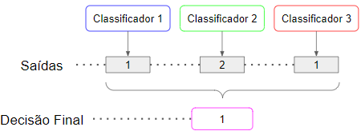
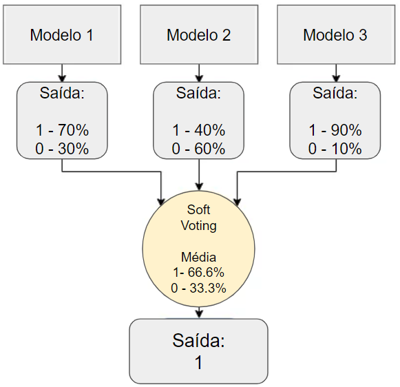

# 4.1 Votação por maioria e soft voting

A votação por maioria é uma estratégia intuitiva e de simples implementação. A decisão de classificação é tomada em favor da classe com maior frequência de predição pelos classificadores que constituem a combinação, como mostrado na Figura 4.1.

 

 <legend>Figura 4.1 - Representação da estratégia de votação majoritária.</legend>

O soft voting é uma técnica de aprendizado de máquina que combina as previsões de vários modelos para gerar uma única previsão. Ele é diferente da votação majoritária, que simplesmente escolhe a previsão mais comum dos modelos. No soft voting, cada modelo atribui uma probabilidade a cada classe. Essas probabilidades são então combinadas para gerar uma nova probabilidade para cada classe. A classe com a probabilidade mais alta é então escolhida como a previsão final. A Figura 4.2 ilustra a estratégia.

 

 <legend>Figura 4.2 - Representação da estratégia soft voting.</legend>

Outra maneira de implementar o soft voting é usar uma função de ponderação. A função de ponderação atribui pesos a cada modelo, de modo que as previsões dos modelos mais confiáveis tenham mais peso.
